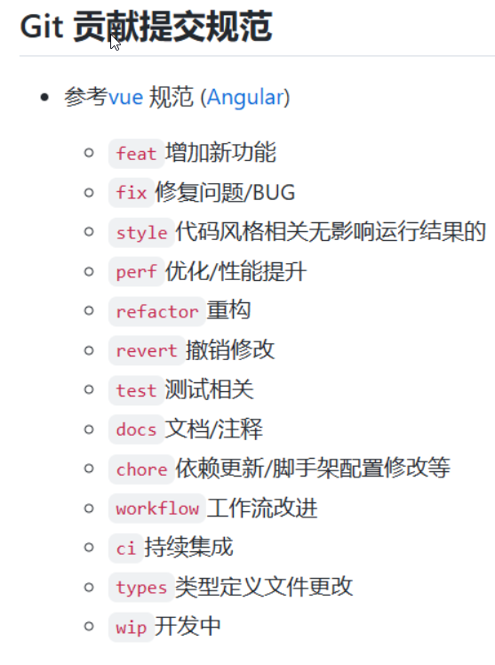

# 这是一个ui组件库,名字目前暂定为view-ui

# view-ui组件开发在components文件中进行开发

## 以VTransfer为案例，index.vue需要满足组件的所有功能，test是测试这个组件功能的。然后我们自己的页面在views/xxx.vue中，引入组件的test.vue

### 这样子可以测试自己的组件是否有效，注意组件是否需要回显，目前组件不需要调用接口，数据在test或index中写死

# 如果要增加开发人员，首先在router里面配置自己的路由，在views增加自己的开发页面，最后在app.vue中添加自己的路由属性即可

# git提交代码请遵照以下规范

# 后续待补充